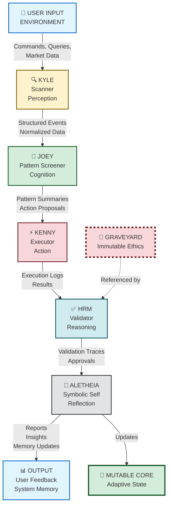
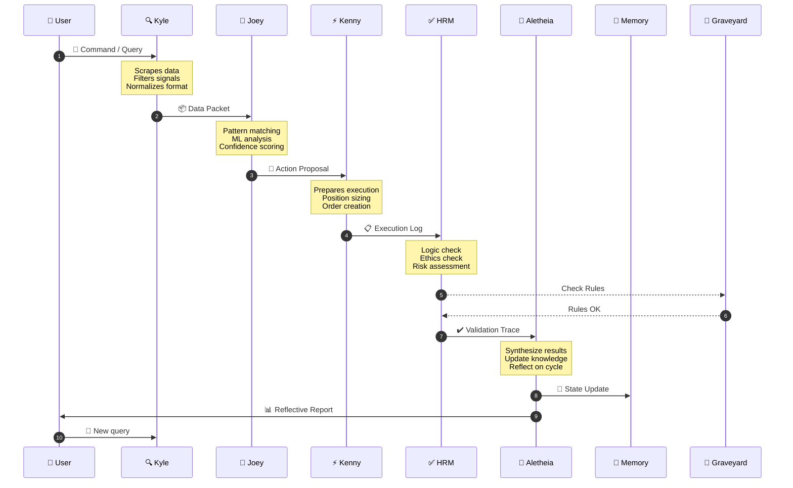
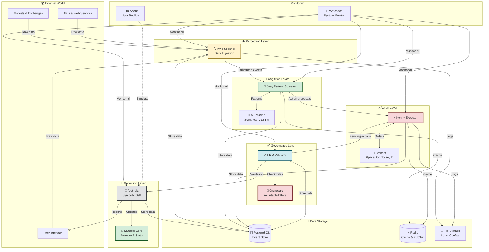
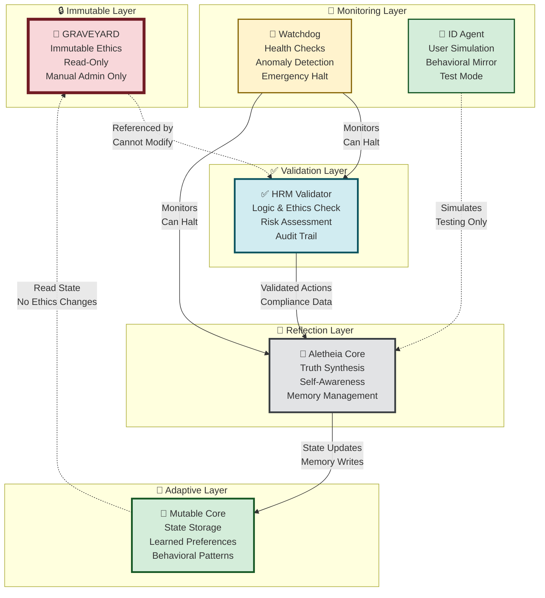
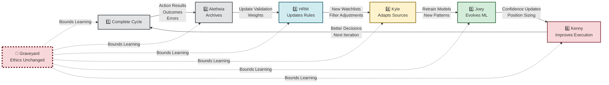
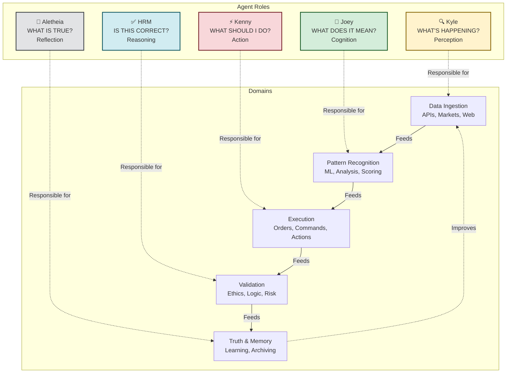
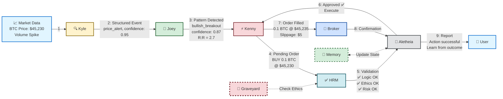
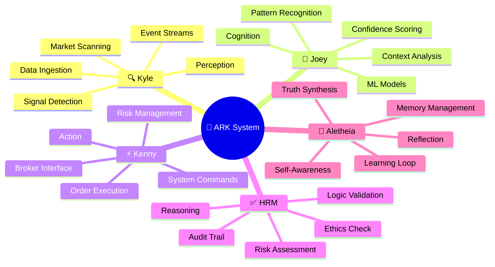
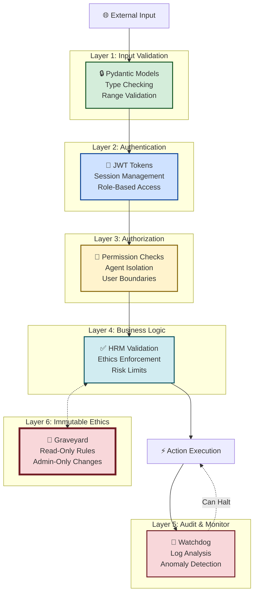
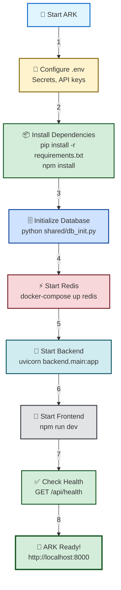

# ARK Architecture - Visual Diagrams

**Quick visual reference for ARK's architecture and data flow**

---

## 🎯 Core Logic Flow



**Key:**
- 🔍 **Kyle**: Sensory input - "What's happening?"
- 🧠 **Joey**: Pattern recognition - "What does it mean?"
- ⚡ **Kenny**: Action execution - "What should I do?"
- ✅ **HRM**: Logic validation - "Is this correct and aligned?"
- 🔮 **Aletheia**: Self-reflection - "What is true and why?"

---

## 🔄 Agent Communication Sequence



---

## 🏗️ System Architecture (Full Stack)



---

## 🔐 Subsystem Interlink (Security Focus)



**Security Boundaries:**
- 📜 **Graveyard**: Immutable, read-only, admin-only changes
- ✅ **HRM**: Acts as gatekeeper, enforces ethics
- 💾 **Mutable Core**: Learns but cannot modify ethics
- 🚨 **Watchdog**: Independent monitor with halt authority

---

## 🔁 Recursive Self-Improvement Loop



**Learning Cycle:**
1. **Complete execution cycle** with results
2. **Aletheia archives** outcomes in memory
3. **HRM updates** validation weights and red flags
4. **Kyle adapts** data sources and filters
5. **Joey evolves** ML models and patterns
6. **Kenny improves** execution strategies
7. **Return to step 1** with enhanced capabilities

**Key Principle:** Learning improves strategy, not ethics

---

## 📊 Agent Responsibility Matrix



---

## 🗺️ Data Flow - From Market to Action



**Timeline:**
1. **T+0ms**: Market data arrives (Kyle)
2. **T+100ms**: Pattern detected (Joey)
3. **T+200ms**: Order prepared (Kenny)
4. **T+250ms**: Validation complete (HRM)
5. **T+300ms**: Approved (Aletheia)
6. **T+500ms**: Order placed (Broker)
7. **T+2000ms**: Confirmation received
8. **T+2100ms**: Learning updated
9. **T+2200ms**: User notified

---

## 🎯 Purpose Mapping (Visual)



---

## 🛡️ Security Layers (Defense in Depth)



**Defense Strategy:**
- 🔒 **Layer 1**: Reject malformed inputs
- 🔑 **Layer 2**: Verify identity
- 👮 **Layer 3**: Check permissions
- ✅ **Layer 4**: Validate against ethics
- 🚨 **Layer 5**: Monitor and alert
- 📜 **Layer 6**: Enforce immutable rules

---

## 📁 Directory Structure (Visual)

```
📦 ARK Repository
├── 🤖 agents/                 # Agent implementations
│   ├── 🔍 kyle.py             # Scanner
│   ├── 🧠 joey.py             # Pattern screener
│   ├── ⚡ kenny.py            # Executor
│   ├── ✅ hrm.py              # Validator
│   ├── 🔮 aletheia.py         # Reflective core
│   ├── 👤 id.py               # User replica
│   ├── 👷 supervisor.py       # Coordinator
│   └── 📋 base_agent.py       # Base class
│
├── 🌐 backend/                # FastAPI server
│   └── 🚀 main.py             # API endpoints
│
├── 🔗 shared/                 # Common modules
│   ├── 🗄️ db_init.py          # Database setup
│   └── 📊 models.py           # Data models
│
├── 📜 graveyard/              # Immutable ethics
│   └── ⚖️ ethics.py           # Core rules (READ-ONLY)
│
├── 💾 mutable_core/           # Adaptive state
│   ├── 🧠 memory.db           # Episodic memory
│   └── ⚙️ preferences.json    # Learned preferences
│
├── 🚨 monitoring/             # System health
│   └── 👁️ watchdog.py         # Monitor & alerts
│
├── ⚙️ config/                 # Configuration
│   ├── 📋 kyle_watchlists.json
│   └── 🎯 joey_patterns.json
│
├── 🎨 frontend/               # Svelte UI
│   ├── 🖼️ src/
│   └── 📦 package.json
│
├── 🧪 tests/                  # Test suite
│   ├── ✅ test_agents.py
│   ├── 🌐 test_backend_api.py
│   └── 🔐 test_hrm_validation.py
│
└── 📚 docs/                   # Documentation
    ├── 📖 ARK_ARCHITECTURE.md
    ├── 📊 ARCHITECTURE_DIAGRAMS.md (this file)
    └── 🔌 API_REFERENCE.md
```

---

## 🚀 Quick Start Flow



---

## 📚 Legend

### Agent Symbols
- 🔍 **Kyle**: Scanner / Perception
- 🧠 **Joey**: Pattern Screener / Cognition
- ⚡ **Kenny**: Executor / Action
- ✅ **HRM**: Validator / Reasoning
- 🔮 **Aletheia**: Reflective Core / Truth
- 👤 **ID**: User Replica
- 👷 **Supervisor**: Agent Coordinator

### System Components
- 📜 **Graveyard**: Immutable Ethics (read-only)
- 💾 **Mutable Core**: Adaptive State (read/write by Aletheia)
- 🚨 **Watchdog**: System Monitor
- 🗄️ **Database**: PostgreSQL/SQLite
- ⚡ **Redis**: Cache & Pub/Sub
- 📁 **File Storage**: Logs & Configs

### Status Indicators
- ✅ Approved / Validated / Passed
- ❌ Rejected / Failed / Error
- ⚠️ Warning / Attention Required
- 🔄 In Progress / Processing
- ⏸️ Paused / Waiting
- 🔒 Secured / Protected
- 🔓 Unlocked / Open Access

---

**Diagrams Version:** 1.0  
**Format:** Mermaid (GitHub/GitLab compatible)  
**Last Updated:** 2025-11-10  
**View in**: GitHub, GitLab, or https://mermaid.live/
