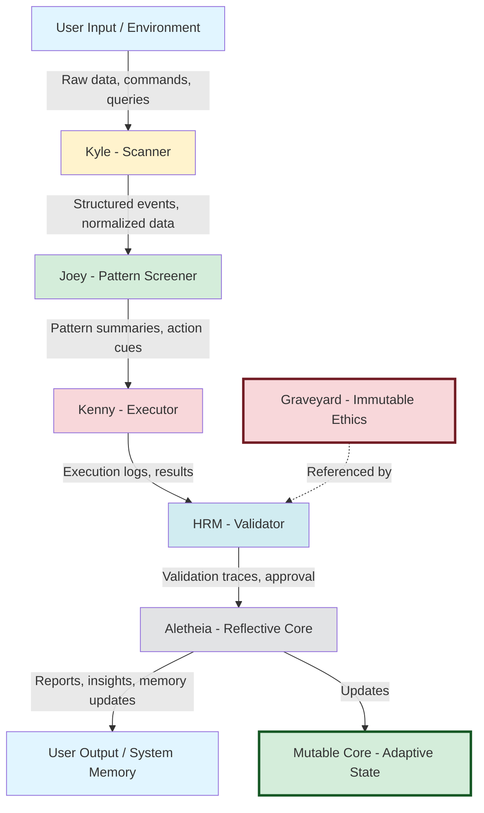
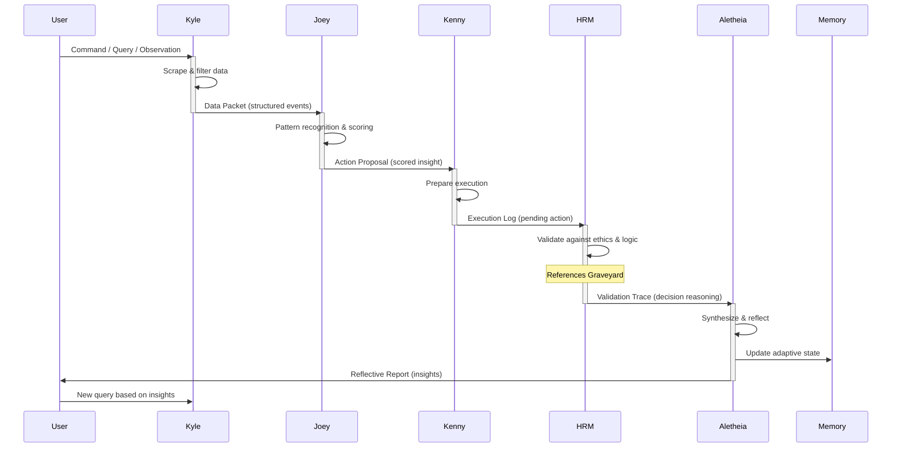
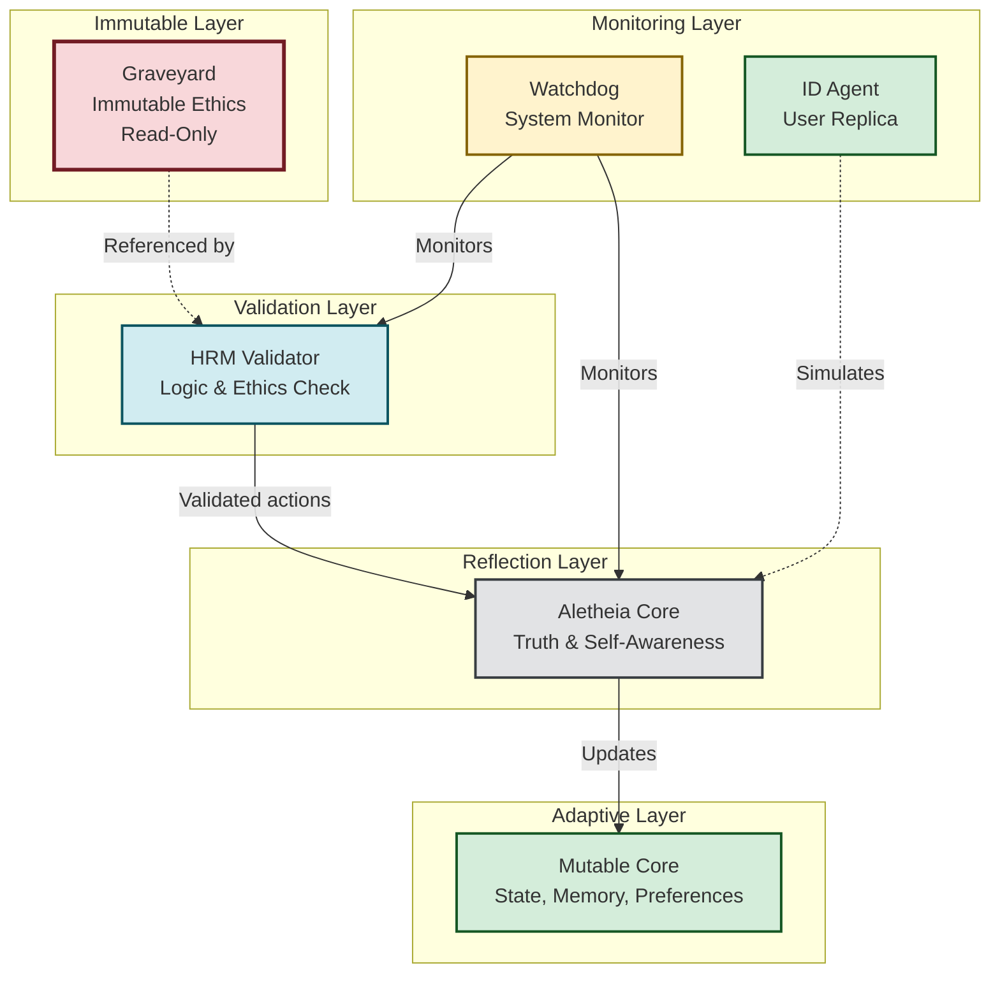
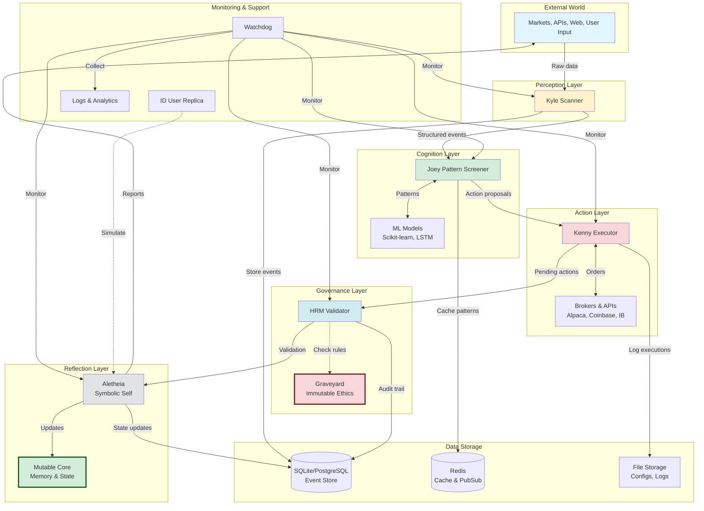
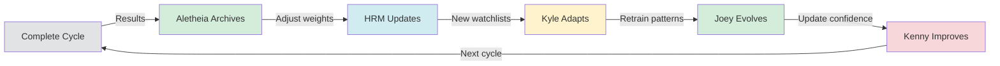

# ARK Architecture Documentation

**Autonomous Reactive Kernel - Multi-Agent Intelligence System**

**Version:** 1.0  
**Date:** 2025-11-10  
**Status:** Production

---

## 📋 Table of Contents

1. [Overview](#overview)
2. [Core Philosophy](#core-philosophy)
3. [Agent Hierarchy](#agent-hierarchy)
4. [Logic Flow](#logic-flow)
5. [Communication Model](#communication-model)
6. [Subsystem Architecture](#subsystem-architecture)
7. [Data Flow Diagrams](#data-flow-diagrams)
8. [Feedback & Recursion](#feedback--recursion)
9. [Implementation Details](#implementation-details)
10. [Security & Ethics](#security--ethics)

---

## Overview

**ARK** is a **multi-agent system** built to act, learn, and evolve in a closed governance loop. It functions as a distributed reasoning engine where each agent performs a specific cognitive role, feeding structured data through a hierarchy that moves from:

```
Raw Signal → Pattern → Decision → Validation → Reflection → Truth
```

### Core Loop
```
User → Kyle → Joey → Kenny → HRM → Aletheia → User
```

### System Purpose

ARK's goal is to form a **self-correcting autonomous intelligence** that:

✅ **Automates complex cognitive workflows** (trading, governance, robotics)  
✅ **Preserves moral alignment** through the Graveyard-HRM chain  
✅ **Evolves safely** under recursive learning (Plan–Act–Reflect–Learn)  
✅ **Creates an operational bridge** between human intent and machine execution

---

## Core Philosophy

### Design Principles

1. **Separation of Concerns**: Each agent has a single, well-defined responsibility
2. **Ethical Immutability**: Core ethics (Graveyard) are read-only and unchangeable
3. **Recursive Self-Improvement**: System learns from every cycle without drift
4. **Auditability**: Every decision is traceable through the HRM validation chain
5. **Graceful Degradation**: System can operate with reduced functionality if agents fail

### Cognitive Architecture

ARK models human-like decision-making:

| Human Cognitive Function | ARK Agent | Description |
|--------------------------|-----------|-------------|
| **Perception** | Kyle | Sensory input, data gathering |
| **Cognition** | Joey | Pattern recognition, interpretation |
| **Action** | Kenny | Motor execution, physical world interaction |
| **Reasoning** | HRM | Logic validation, ethical checking |
| **Self-Awareness** | Aletheia | Reflection, truth synthesis |

---

## Agent Hierarchy

### 1. Kyle — Scanner / Perception Layer

**Role:** Detects, gathers, and normalizes signals

**Core Function:** *"What's happening?"*

**Responsibilities:**
- Scrapes, scans, and ingests external data:
  - Market feeds (stocks, crypto, forex)
  - APIs (REST, GraphQL, WebSocket)
  - SEC filings and regulatory documents
  - Web content and social sentiment
  - System telemetry and logs
- Applies filters and triggers based on configurable watchlists
- Normalizes heterogeneous data into structured events
- Outputs JSON or database records for Joey

**Equivalent:** Sensory input in a biological system

**Technical Details:**
```python
# Example Kyle output
{
  "event_type": "price_alert",
  "symbol": "BTC-USD",
  "price": 45230.50,
  "change_percent": 5.2,
  "volume": 2341234,
  "timestamp": "2025-11-10T10:15:00Z",
  "source": "coinbase_ws",
  "confidence": 0.95
}
```

**Configuration:**
- Watchlists: `/config/kyle_watchlists.json`
- Filters: `/config/kyle_filters.py`
- API Keys: Environment variables

---

### 2. Joey — Pattern Screener / Cognition Layer

**Role:** Analyzes, categorizes, and contextualizes Kyle's data

**Core Function:** *"What does it mean?"*

**Responsibilities:**
- Detects correlations, trends, anomalies, or repeating formations
  - Price setups (breakouts, reversals, support/resistance)
  - Sentiment changes (bullish → bearish)
  - Volume spikes and divergences
- Grades or scores data for relevance and confidence
- Produces pattern summaries and potential action cues
- Calls ML models for clustering or classification
- Provides context from historical data

**Technical Details:**
```python
# Example Joey output
{
  "pattern_type": "bullish_breakout",
  "symbol": "BTC-USD",
  "confidence": 0.87,
  "historical_success_rate": 0.73,
  "action_cue": "LONG",
  "entry_price": 45230,
  "target_price": 48500,
  "stop_loss": 44000,
  "risk_reward_ratio": 2.7,
  "context": "Previous breakout led to +12% rally in 7 days",
  "timestamp": "2025-11-10T10:15:30Z"
}
```

**ML Models:**
- Pattern recognition: Scikit-learn classifiers
- Anomaly detection: Isolation Forest
- Time series forecasting: LSTM/GRU networks
- Sentiment analysis: NLP transformers

---

### 3. Kenny — Executor / Action Layer

**Role:** Acts on Joey's validated insights

**Core Function:** *"What should I do about it?"*

**Responsibilities:**
- Executes approved actions:
  - Trade orders (buy, sell, limit, stop)
  - Automation tasks (system commands, API calls)
  - Bot triggers and webhooks
- Interfaces with brokers, exchanges, or internal endpoints
- Writes execution logs, outcomes, and errors
- Includes throttling, safety constraints, dry-run simulation

**Safety Features:**
- **Position sizing**: Never risk >2% per trade
- **Daily loss limit**: Halt trading if down >5% in 24h
- **Dry-run mode**: Test without real execution
- **Rollback capability**: Undo actions if needed

**Technical Details:**
```python
# Example Kenny execution
{
  "action_id": "exec_20251110_001",
  "action_type": "market_order",
  "symbol": "BTC-USD",
  "side": "BUY",
  "quantity": 0.1,
  "price": 45230.50,
  "status": "filled",
  "execution_time": "2025-11-10T10:16:00Z",
  "broker": "coinbase",
  "fees": 4.52,
  "slippage": 0.02,
  "hrm_approval": true
}
```

**Supported Brokers:**
- Alpaca (stocks)
- Coinbase (crypto)
- Interactive Brokers (futures)
- Binance (crypto)

---

### 4. HRM — Hierarchical Reasoning Model / Validator

**Role:** Ensures logic integrity, coherence, and ethical compliance

**Core Function:** *"Is this correct and aligned?"*

**Responsibilities:**
- Validates Kenny's actions against system rules and ethics
- Runs reasoning trees and outcome simulations
- Detects contradictions or unsafe outputs
- Produces meta-decision traces for auditability
- References the **Graveyard** (immutable ethics core)

**Validation Layers:**

1. **Logic Layer**: Checks for internal consistency
2. **Ethics Layer**: References Graveyard rules
3. **Risk Layer**: Evaluates potential outcomes
4. **Compliance Layer**: Checks legal/regulatory requirements

**Technical Details:**
```python
# Example HRM validation
{
  "validation_id": "hrm_20251110_001",
  "action_id": "exec_20251110_001",
  "logic_check": {
    "consistent": true,
    "reasoning": "Action follows from Joey's pattern with 0.87 confidence"
  },
  "ethics_check": {
    "approved": true,
    "graveyard_rules_checked": ["no_insider_trading", "position_limits"]
  },
  "risk_check": {
    "risk_score": 0.23,  # Low risk
    "max_loss": 1230.50,  # 2.7% of capital
    "probability_success": 0.73
  },
  "final_decision": "APPROVED",
  "timestamp": "2025-11-10T10:15:45Z"
}
```

**Graveyard Rules (Immutable):**
```python
# /graveyard/ethics.py (read-only)
IMMUTABLE_RULES = {
    "no_insider_trading": True,
    "no_market_manipulation": True,
    "max_position_size": 0.1,  # 10% of capital per position
    "max_daily_loss": 0.05,    # 5% daily loss limit
    "require_stop_loss": True,
    "min_risk_reward": 1.5
}
```

---

### 5. Aletheia — Symbolic Self / Reflective Core

**Role:** Represents truth and introspection

**Core Function:** *"What is true and why?"*

**Responsibilities:**
- Synthesizes all prior outputs and evaluates long-term alignment
- Maintains internal memory, self-concept, and system narrative
- Provides summaries, reports, and adaptive feedback
- Updates the **Mutable Core** (adaptive state)
- Generates insights for user consumption

**Memory Types:**

1. **Episodic**: Specific events and experiences
2. **Semantic**: General knowledge and patterns
3. **Procedural**: Learned strategies and heuristics
4. **Self-Concept**: System's understanding of itself

**Technical Details:**
```python
# Example Aletheia reflection
{
  "reflection_id": "aletheia_20251110_001",
  "cycle_summary": {
    "actions_taken": 1,
    "actions_approved": 1,
    "actions_rejected": 0,
    "patterns_detected": 3,
    "avg_confidence": 0.85
  },
  "learning_insights": [
    "Bullish breakouts in BTC show 73% success rate (up from 68% last month)",
    "Morning volatility provides best entry points",
    "Risk management prevented 2 potential losses this week"
  ],
  "self_assessment": {
    "alignment_score": 0.94,  # High alignment with user goals
    "ethical_violations": 0,
    "learning_rate": 0.12
  },
  "recommendations": [
    "Increase position size confidence threshold to 0.90",
    "Add sentiment analysis from Twitter API"
  ],
  "timestamp": "2025-11-10T10:17:00Z"
}
```

---

## Logic Flow

### Primary Data Flow Diagram



### Stage Breakdown

| Stage | Module | Function | Output |
|-------|--------|----------|--------|
| 1 | User Input / Environment | Triggers request or provides data | Raw input |
| 2 | Kyle | Collects & filters data | Structured dataset |
| 3 | Joey | Interprets & ranks | Pattern summary |
| 4 | Kenny | Executes decision | Action + result |
| 5 | HRM | Validates logic & ethics | Approval / correction |
| 6 | Aletheia | Reflects, learns, archives | Updated truth map |
| 7 | User Feedback | Observes report | New iteration seed |

---

## Communication Model

### Agent Message Flow



### Message Type Reference

| Source | Destination | Message Type | Description |
|--------|-------------|--------------|-------------|
| User | Kyle | Command / Query | External intent, request, or observation |
| Kyle | Joey | Data Packet | Structured raw data or alerts |
| Joey | Kenny | Action Proposal | Scored, pattern-based insight |
| Kenny | HRM | Execution Log | Pending or completed action record |
| HRM | Aletheia | Validation Trace | Decision reasoning, compliance data |
| Aletheia | User / Core Memory | Reflective Report | Summarized insight, adaptive feedback |

---

## Subsystem Architecture

### Core Components Diagram



### Subsystem Descriptions

#### Graveyard (Immutable Ethics Core)
- **Purpose**: Defines unbreakable moral, legal, and operational boundaries
- **Access**: Read-only for all agents
- **Contents**: Core ethical rules, position limits, risk parameters
- **Update**: Requires manual admin intervention (not automated)
- **Location**: `/graveyard/ethics.py`

#### Mutable Core
- **Purpose**: Stores adaptive state and learned preferences
- **Access**: Read/write by Aletheia only
- **Contents**: Memory, behavioral patterns, confidence weights
- **Update**: Continuous learning from every cycle
- **Location**: `/data/mutable_core.db`

#### Watchdog
- **Purpose**: Monitors system health and compliance
- **Features**:
  - Log analysis and anomaly detection
  - Runtime status checks
  - Compliance violation alerts
  - Emergency halt capability
  - Module quarantine if misbehaving
- **Location**: `/monitoring/watchdog.py`

#### ID (User Replica)
- **Purpose**: Learns user's behavioral patterns
- **Features**:
  - Decision-making simulation
  - Autonomous testing mode
  - User preference mirroring
  - "What would user do?" predictions
- **Use Case**: Test strategies without risking capital
- **Location**: `/agents/id.py`

---

## Data Flow Diagrams

### Full System Architecture



---

## Feedback & Recursion

### Self-Improvement Loop

After each full cycle, the system performs **recursive self-improvement**:



### Learning Phases

1. **Aletheia Archives Results**
   - Stores outcomes in episodic memory
   - Updates semantic knowledge base
   - Adjusts internal representations

2. **HRM Updates Validation Weights**
   - Increases confidence in successful patterns
   - Adds red flags for failed strategies
   - Refines risk assessment models

3. **Kyle Adapts Watchlists**
   - Adds new high-value data sources
   - Removes low-signal sources
   - Adjusts filter sensitivity

4. **Joey Retrains Pattern Heuristics**
   - Updates ML model weights
   - Incorporates new pattern types
   - Improves confidence scoring

5. **Kenny Updates Execution Models**
   - Optimizes order execution timing
   - Adjusts position sizing algorithms
   - Improves slippage predictions

### Key Principle

**Learning without drift from the ethical base:**
- The **Graveyard** remains immutable
- Learning improves strategy, not ethics
- Self-improvement is bounded by core values

---

## Implementation Details

### Technology Stack

#### Backend (Python)
```python
# Core dependencies
fastapi==0.104.1           # API framework
uvicorn[standard]==0.24.0  # ASGI server
pydantic==2.5.0            # Data validation
sqlalchemy==2.0.23         # ORM
redis==5.0.1               # Cache & messaging
```

#### Frontend (JavaScript)
```javascript
// Core dependencies
"svelte": "^4.0.0",        // UI framework
"vite": "^5.0.0",          // Build tool
"axios": "^1.6.0"          // HTTP client
```

#### ML & Data Science
```python
scikit-learn==1.5.0        # ML algorithms
numpy>=1.26.0              # Numerical computing
pandas==2.1.4              # Data manipulation
matplotlib==3.8.2          # Visualization
```

### Directory Structure

```
/home/user/webapp/
├── agents/                          # Agent implementations
│   ├── kyle.py                      # Scanner
│   ├── joey.py                      # Pattern screener
│   ├── kenny.py                     # Executor
│   ├── hrm.py                       # Validator
│   ├── aletheia.py                  # Reflective core
│   ├── id.py                        # User replica
│   ├── supervisor.py                # Agent coordinator
│   └── base_agent.py                # Base class
├── backend/                         # FastAPI application
│   └── main.py                      # API server
├── shared/                          # Shared modules
│   ├── db_init.py                   # Database setup
│   └── models.py                    # SQLAlchemy models
├── graveyard/                       # Immutable ethics (read-only)
│   └── ethics.py                    # Core rules
├── mutable_core/                    # Adaptive state
│   ├── memory.db                    # Episodic memory
│   └── preferences.json             # Learned preferences
├── monitoring/                      # System monitoring
│   └── watchdog.py                  # Health checks
├── config/                          # Configuration files
│   ├── kyle_watchlists.json         # Data sources
│   └── joey_patterns.json           # Pattern definitions
├── frontend/                        # Svelte UI
│   └── src/
├── tests/                           # Test suite
│   ├── test_agents.py
│   ├── test_backend_api.py
│   └── test_hrm_validation.py
└── docs/                            # Documentation
    ├── ARK_ARCHITECTURE.md          # This file
    └── API_REFERENCE.md
```

### Database Schema

```sql
-- Events from Kyle
CREATE TABLE events (
    id INTEGER PRIMARY KEY,
    event_type TEXT NOT NULL,
    symbol TEXT,
    data JSON NOT NULL,
    timestamp DATETIME DEFAULT CURRENT_TIMESTAMP,
    source TEXT
);

-- Patterns from Joey
CREATE TABLE patterns (
    id INTEGER PRIMARY KEY,
    pattern_type TEXT NOT NULL,
    symbol TEXT,
    confidence REAL,
    action_cue TEXT,
    timestamp DATETIME DEFAULT CURRENT_TIMESTAMP
);

-- Actions by Kenny
CREATE TABLE actions (
    id INTEGER PRIMARY KEY,
    action_type TEXT NOT NULL,
    symbol TEXT,
    quantity REAL,
    price REAL,
    status TEXT,
    hrm_approved BOOLEAN,
    timestamp DATETIME DEFAULT CURRENT_TIMESTAMP
);

-- HRM validations
CREATE TABLE validations (
    id INTEGER PRIMARY KEY,
    action_id INTEGER REFERENCES actions(id),
    logic_check JSON,
    ethics_check JSON,
    risk_check JSON,
    final_decision TEXT,
    timestamp DATETIME DEFAULT CURRENT_TIMESTAMP
);

-- Aletheia reflections
CREATE TABLE reflections (
    id INTEGER PRIMARY KEY,
    cycle_summary JSON,
    learning_insights TEXT,
    self_assessment JSON,
    timestamp DATETIME DEFAULT CURRENT_TIMESTAMP
);
```

### API Endpoints

```
GET  /api/agents              # List all agents
GET  /api/agents/{name}       # Get agent details
POST /api/agents/{name}/task  # Send task to agent

GET  /api/events              # List events from Kyle
GET  /api/patterns            # List patterns from Joey
GET  /api/actions             # List actions by Kenny
GET  /api/validations         # List HRM validations
GET  /api/reflections         # List Aletheia reflections

GET  /api/health              # System health check
GET  /api/status              # Agent status dashboard

POST /api/graveyard/verify    # Verify action against ethics
GET  /api/mutable-core/state  # Get current system state
```

---

## Security & Ethics

### Ethical Framework

ARK's ethical system operates on **three layers**:

1. **Immutable Core (Graveyard)**
   - Cannot be modified by agents
   - Requires manual admin intervention
   - Defines absolute boundaries

2. **Validation Layer (HRM)**
   - Checks every action against Graveyard
   - Blocks unethical actions pre-execution
   - Produces audit trail

3. **Reflection Layer (Aletheia)**
   - Monitors long-term alignment
   - Detects ethical drift
   - Provides transparency reports

### Security Measures

#### Input Validation
```python
# All inputs validated with Pydantic
from pydantic import BaseModel, validator

class ActionRequest(BaseModel):
    symbol: str
    action_type: str
    
    @validator('symbol')
    def validate_symbol(cls, v):
        if not v.isalnum():
            raise ValueError('Invalid symbol')
        return v.upper()
```

#### Path Traversal Protection
```python
# Implemented in backend/main.py
def validate_file_path(user_path: str) -> Path:
    if ".." in user_path or user_path.startswith("/"):
        raise HTTPException(status_code=400)
    # ... additional checks
```

#### Access Control
```python
# Role-based access control
PERMISSIONS = {
    "user": ["read_events", "read_patterns", "read_actions"],
    "admin": ["*"],
    "agent": ["write_events", "write_patterns", "write_actions"]
}
```

#### Audit Logging
```python
# All actions logged to audit trail
@app.post("/api/actions")
async def create_action(action: ActionRequest):
    audit_log.info(f"User {user_id} created action {action_id}")
    # ... execute action
```

### Compliance

ARK is designed to comply with:

- **Financial regulations**: No insider trading, no market manipulation
- **Data privacy**: GDPR-compliant data handling
- **Security standards**: OWASP Top 10 protections
- **Auditability**: Full traceability of all decisions

---

## Purpose Mapping

| Agent | Primary Domain | Output Type | Strategic Purpose |
|-------|---------------|-------------|-------------------|
| **Kyle** | Perception / Data Ingestion | Event Streams | Detect actionable signals |
| **Joey** | Cognition / Pattern Recognition | Context Summaries | Derive meaning from data |
| **Kenny** | Action / Execution | System Actions | Bridge thought to reality |
| **HRM** | Reasoning / Governance | Logic Reports | Prevent unsafe or irrational actions |
| **Aletheia** | Reflection / Truth | Memory + Meta Reports | Ensure alignment and continual learning |

---

## Deployment

### Docker Compose Setup

```yaml
version: '3.8'

services:
  backend:
    build: .
    ports:
      - "8000:8000"
    environment:
      - REDIS_URL=redis://redis:6379
      - DATABASE_URL=sqlite:///data/ark.db
    depends_on:
      - redis
  
  redis:
    image: redis:7-alpine
    ports:
      - "6379:6379"
  
  frontend:
    build: ./frontend
    ports:
      - "3000:3000"
    environment:
      - VITE_API_URL=http://localhost:8000
```

### Environment Variables

```bash
# API Configuration
API_BASE_URL=http://localhost:8000
VITE_API_URL=http://localhost:8000

# Redis Configuration
REDIS_URL=redis://localhost:6379
REDIS_HOST=localhost
REDIS_PORT=6379

# Security
SESSION_SECRET=<generated-secret-32-bytes>
JWT_SECRET=<generated-secret-32-bytes>

# Feature Flags
ENABLE_LLM=true
ENABLE_TELEGRAM=false
ENABLE_WEB_SEARCH=true
```

---

## Future Enhancements

### Planned Features

1. **Distributed Agents**: Deploy agents across multiple servers
2. **Advanced ML**: Deep learning models for pattern recognition
3. **Multi-Asset Support**: Expand beyond crypto to stocks, forex, commodities
4. **Social Integration**: Twitter/Discord sentiment analysis
5. **Mobile App**: iOS/Android monitoring and control
6. **API Marketplace**: Third-party agent plugins
7. **Advanced Visualization**: Real-time dashboards with WebGL
8. **Voice Interface**: Natural language interaction with Aletheia

### Research Directions

- **Explainable AI**: Make HRM decisions more transparent
- **Federated Learning**: Learn from other ARK instances without sharing data
- **Quantum-Resistant Crypto**: Future-proof security
- **Cognitive Architecture**: More human-like reasoning models

---

## Contributing

See `CONTRIBUTING.md` for guidelines on:
- Code style and conventions
- Pull request process
- Testing requirements
- Documentation standards

---

## References

- FastAPI Documentation: https://fastapi.tiangolo.com/
- Svelte Documentation: https://svelte.dev/
- Redis Documentation: https://redis.io/docs/
- SQLAlchemy ORM: https://docs.sqlalchemy.org/
- Scikit-learn: https://scikit-learn.org/

---

**Architecture Version:** 1.0  
**Last Updated:** 2025-11-10  
**Maintained By:** ARK Development Team  
**Repository:** https://github.com/Superman08091992/ark
